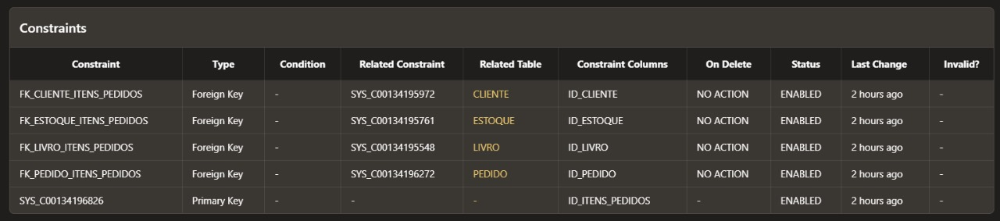

# Livraria

O exercício feito foi a criação de um banco de dados de uma livraria. Contendo tabelas de clientes, livros, editoras, pedidos e itens pedidos. 

# Criação das Tabelas

A seguir, os statements de criação das tabelas com suas imagens:

## Livro

A tabela contém o id do livro, nome, autor, preço, categoria, o ISBN e ano de publicação. Tendo o id do livro como Primary Key.

Em seguida, um update para acrescentar as foreign key de id da editora e id do estoque.

### Statement
 
```sql
CREATE TABLE livro (  
    id_livro NUMBER,  
    nome_livro VARCHAR2(40),  
    autor VARCHAR2(40),  
    preco REAL,  
    categoria VARCHAR2(45),  
    ISBN VARCHAR2(20),  
    ano DATE, 
    PRIMARY KEY (id_livro) 
) 
```

Update:

```sql
ALTER TABLE livro 
ADD CONSTRAINT fk_editora FOREIGN KEY (id_editora) 
REFERENCES editora(id_editora)

ALTER TABLE livro 
ADD CONSTRAINT fk_estoque FOREIGN KEY (id_estoque) 
REFERENCES estoque(id_estoque)
```

### Tabela


## Editora

A tabela contém o id da editora, nome e contato. Tendo id da editora como primary key.

### Statement

```sql
create table editora ( 
    id_editora number,  
    contato varchar2(45),  
    nome_editora varchar2(255),  
    primary key (id_editora) 
)
```

### Tabela


## Estoque

A tabela contém o id do estoque, quantidade de livros e id do livro. Tendo id da editora como primary key e id do livro como foreign key.

### Statement

```sql
create table estoque ( 
    id_estoque number,  
    quantidade_estoque number,  
    id_livro number,  
    primary key (id_estoque), 
    constraint fk_livro foreign key (id_livro) references livro(id_livro) 
)
```

### Tabela


## Cliente

A tabela contém o id do cliente, nome do cliente, telefone, endereço com rua, numero, complemento, CEP, cidade e estado; CPF e RG do cliente. Tendo id do cliente como primary key.

### Statement

```sql
create table cliente (  
    id_cliente number,  
    nome varchar2(255),  
    telefone varchar2(20), 
    rua varchar2(45), 
    numero varchar2(20), 
    complemento varchar2(45), 
    cep varchar2(20), 
    cidade varchar2(45), 
    estado varchar(20), 
    cpf varchar2(11), 
    rg varchar2(20), 
    primary key (id_cliente) 
)
```

### Tabela


## Pedido

A tabela contém o id do pedido, id do cliente, data do pedido e o valor total do pedido. Tendo id do pedido como primary key e id do cliente como foreign key.

### Statement

```sql
create table pedido ( 
    id_pedido NUMBER,  
    id_cliente NUMBER, 
    data_pedido DATE, 
    valor_pedido REAL, 
    PRIMARY KEY (id_pedido), 
    CONSTRAINT fk_cliente FOREIGN KEY (id_cliente) REFERENCES cliente (id_cliente) 
)
```

### Tabela


## Itens Pedidos

A tabela contém o id dos itens pedidos, id do cliente, id do livro, id do estoque, id do pedido, quantidade de pedidos e o valor de cada livro. Tendo id dos itens pedidos como primary key e id do livro, id do estoque e id do cliente como foreign key.

### Statement

```sql
CREATE TABLE itens_pedidos ( 
    id_itens_pedidos NUMBER,  
    id_cliente NUMBER, 
    id_livro NUMBER, 
    id_estoque NUMBER, 
    id_pedido NUMBER, 
    quantidade_pedido NUMBER, 
    valores_itens_pedidos REAL, 
    PRIMARY KEY (id_itens_pedidos), 
    CONSTRAINT fk_cliente_itens_pedidos FOREIGN KEY (id_cliente) REFERENCES cliente (id_cliente), 
    CONSTRAINT fk_livro_itens_pedidos FOREIGN KEY (id_livro) REFERENCES livro (id_livro), 
    CONSTRAINT fk_pedido_itens_pedidos FOREIGN KEY (id_pedido) REFERENCES pedido (id_pedido), 
    CONSTRAINT fk_estoque_itens_pedidos FOREIGN KEY (id_estoque) REFERENCES estoque (id_estoque) 
)
```

### Tabela




# Procedures

Algumas procedures foram feitas para utilizar ou inserir dados em banco de dados.

## Statement 1 

Procedure de cadastrar um livro, sua editora e colocar a quantidade de estoque do livro disponível. 

```sql
PROCEDURE cadastrar_livro ( 
    id_livro_p NUMBER, 
    nome_livro_p VARCHAR2, 
    autor_p VARCHAR2, 
    preco_p REAL, 
    categoria_p VARCHAR2, 
    ISBN_p VARCHAR2, 
    ano_p DATE, 
    id_editora_p NUMBER, 
	id_estoque_p NUMBER, 
    quantidade_estoque_p NUMBER, 
    contato_p VARCHAR2, 
    nome_editora_p VARCHAR2  
) 
AS 
BEGIN 
	INSERT INTO editora (id_editora, contato, nome_editora)  
    VALUES (id_editora_p, contato_p, nome_editora_p);  
	DBMS_OUTPUT.PUT_LINE('Editora cadastrada no Banco de Dados com sucesso'); 
 
	INSERT INTO livro (id_livro, nome_livro, autor, preco, categoria, ISBN, ano, id_editora)     
	VALUES (id_livro_p, nome_livro_p, autor_p, preco_p, categoria_p, ISBN_p, ano_p, id_editora_p);   
	DBMS_OUTPUT.PUT_LINE('Livro colocado no Banco de Dados com sucesso');  
 
	INSERT INTO estoque (id_estoque, quantidade_estoque, id_livro)     
    VALUES (id_estoque_p, quantidade_estoque_p, id_livro_p);  
	DBMS_OUTPUT.PUT_LINE('Livro colocado no Banco de Dados de Estoque com sucesso');  
 
	UPDATE livro 
	SET id_estoque = id_estoque_p 
	WHERE id_livro = id_livro_p; 
 
END;
/
```

## Statement 2

Procedure cadastrando um livro em que a editora é a mesma de outro livro, portanto, sua editora já está cadastrada no banco de dados.

```sql
PROCEDURE cadastrar_livro_editora_conhecida (   
    id_livro_p NUMBER,   
    nome_livro_p VARCHAR2,   
    autor_p VARCHAR2,   
    preco_p REAL,   
    categoria_p VARCHAR2,   
    ISBN_p VARCHAR2,   
    ano_p DATE,  
    id_editora_p NUMBER, 
    id_estoque_p NUMBER, 
    quantidade_estoque_p NUMBER 
)   
IS   
BEGIN   
    INSERT INTO livro (id_livro, nome_livro, autor, preco, categoria, ISBN, ano, id_editora)     
	VALUES (id_livro_p, nome_livro_p, autor_p, preco_p, categoria_p, ISBN_p, ano_p, id_editora_p);   
	DBMS_OUTPUT.PUT_LINE('Livro colocado no Banco de Dados com sucesso');  
 
	INSERT INTO estoque (id_estoque, quantidade_estoque, id_livro) 
    VALUES (id_estoque_p, quantidade_estoque_p, id_livro_p); 
	DBMS_OUTPUT.PUT_LINE('Livro cadastrado no estoque'); 
 
    UPDATE livro 
    SET id_estoque = id_estoque_p 
    WHERE id_livro = id_livro_p; 
 
END;
/
```

## STATEMENT 3

Procedure de checar o dado de preço e quantidade no estoque utilizando somente a id do livro.

```sql
PROCEDURE checar_preco_estoque ( 
    id_livro_p NUMBER 
) 
 
IS 
    id_estoque_p NUMBER; 
    qtd_estoque_p NUMBER; 
    preco_livro_p REAL; 
    nome_livro_p VARCHAR2(40); 
 
BEGIN 
 
    id_estoque_p := id_livro_p; 
     
	SELECT nome_livro 
	INTO nome_livro_p 
	FROM livro 
	WHERE id_livro = id_livro_p; 
 
	SELECT preco 
	INTO preco_livro_p 
	FROM livro 
	WHERE id_livro = id_livro_p; 
 
	SELECT quantidade_estoque 
	INTO qtd_estoque_p 
	FROM estoque 
	WHERE id_estoque = id_estoque_p; 
 
	DBMS_OUTPUT.PUT_LINE('O livro ' || nome_livro_p || ' se encontra no preço de R$' || preco_livro_p || ' com estoque de ' || qtd_estoque_p || ' livros.'); 
 
END; 
/
```